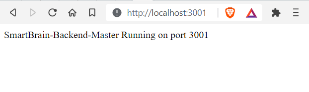

# All SmartBrain Repos
- **SmartBrain v1: [Client](https://github.com/rbhachu/smartbrain-frontend/) / [Server](https://github.com/rbhachu/smartbrain-backend/)** 
- **SmartBrain v2: [Client](https://github.com/rbhachu/smartbrain-frontend-jwt/) / [Server](https://github.com/rbhachu/smartbrain-backend-jwt/)** 
- **SmartBrain Docker v1: [Docker Server](https://github.com/rbhachu/smartbrain-backend-docker)** 
- **SmartBrain Docker v2: [Docker Client + Server](https://github.com/rbhachu/smartbrain-master-docker/)** 

----

[](https://github.com/rbhachu/smartbrain-backend-jwt) [](https://github.com/rbhachu/smartbrain-backend-jwt)

__*Updated Version of this Repo: https://github.com/rbhachu/smartbrain-master-docker*__
<br><br>

<h1 align="center">SmartBrain v2 Server</h1>
<br>

## Description
<p>Back-End Server for SmartBrain Front-End Client, running Node, Express, Redis and PostgreSQL servers.<br><br>
Requires SmartBrain Front-End Client, please see repo for full details; https://github.com/rbhachu/smartbrain-frontend-jwt
</p><br>


## Dependencies/NPM Modules
[Bcrypt: v5.0.1 *](https://www.npmjs.com/package/bcrypt) - For password encryption/decrytion between PostgreSQL DB
<br>
[Clarifai: v2.9.1 *](https://www.npmjs.com/package/clarifai) - For Face Detection API
<br>
[Clarifai API Key **](https://www.clarifai.com/models/ai-face-detection) - Free API Key required to use Clarifai Face Detection API
<br>
[Cors: v2.8.5 *](https://www.npmjs.com/package/cors) - Cross-Origin Resource Sharing 
(server to server)
<br>
[Dotenv: v10.0.0 *](https://www.npmjs.com/package/dotenv) - For environment variables
<br>
[Express: v4.17.1 *](https://www.npmjs.com/package/express) - Node.js server
<br>
[JSONwebtoken: v8.5.1 *](https://www.npmjs.com/package/jsonwebtoken) -  For JSON Web Tokens
<br>
[Knex: v0.95.6 *](https://www.npmjs.com/package/knex) - SQL Query Builder for JavaScript
<br>
[Morgan: v1.10.0 *](https://www.npmjs.com/package/morgan) - HTTP request logger middleware for node.js (for testing server responses)
<br>
[NodeMon: v2.0.7 *](https://www.npmjs.com/package/nodemon) - Node.js development tool
<br>
[PG: v8.6.0 *](https://www.npmjs.com/package/pg) - Non-blocking PostgreSQL client for Node.js
<br>
[PostgreSQL Database **](https://www.postgresql.org/download/) - Used for User Database
<br>
[Redis: v3.1.2 *](https://www.npmjs.com/package/redis) - Redis client for Node.js
<br>
Redis Database ** - For JSON Web Token Management
<br>

<i>
* Installed automatically<br>
** Requires manual installation/setup - see below
</i>
<br><br>


## Installation Prerequisites

### Clarifai API Key
You will need to obtain a free API key from Clarifai<br><br>
API Key Link: https://www.clarifai.com/models/ai-face-detection
<br><br>

### PostgreSQL Database Installation
You will need to install a local instance of PostgreSQL server to install the User and Login tables required for the site.<br><br>
PostgreSQL Download Link: https://www.postgresql.org/download/<br>
PostgreSQL Installation Guide: https://www.postgresqltutorial.com/install-postgresql/
<br><br>

Once you have installed PostgreSQL Database, use the following SQL statements to create the Login, Users Tables and Seed them too.
<br><br>


Login Table SQL
````sql
BEGIN TRANSACTION;

CREATE TABLE login (
    id serial PRIMARY KEY,
    hash varchar(100) NOT NULL,
    email text UNIQUE NOT NULL
);

COMMIT;
````
<br>

Users Table SQL
````sql
BEGIN TRANSACTION;

CREATE TABLE users (
    id serial PRIMARY KEY,
    name VARCHAR(100),
    email text UNIQUE NOT NULL,
    entries BIGINT DEFAULT 0,
    joined TIMESTAMP NOT NULL
);

COMMIT;
````
<br>

Seed Data SQL - To populate with first user for testing
````sql
-- Seed data with a fake user for testing

BEGIN TRANSACTION;

insert into users (name, email, entries, joined) values ('aaa', 'a@a.com', 0, '2021-06-06');
insert into login (hash, email) values ('$2a$10$WAK21U0LWl7C//jJ.DOB2uPP1DJQh7KUDgasdyQeGzkop2Pzl8W7u', 'a@a.com');

COMMIT;
````
<i>The password is hashed using Bcrypt, however the test login details are as follows; Email: a&a.com, Password: a 
</i>
<br><br>


### Redis Database Installation
You will need to install a local instance of Redis server for login authentication with JSON Web Tokens.
<br><br>

PostgreSQL Installation Guide: https://redislabs.com/blog/redis-on-windows-10/
<br><br>

Once you have completed the steps in the 'Installation Prerequisites' above you can continue on to the final installation steps below.
<br><br>


## Installation 
<p>Open your Code Editor and 'CD' into your working directory, then download the repo to that location, by executing the following command in your terminal.<p>

```sh
git clone https://github.com/rbhachu/smartbrain-backend-jwt.git
```

<p>Once the repo has been downloaded, 'CD' to the newly downloaded project folder. Then execute the following command in your terminal.<p>

```sh
npm install
```

<p>Also check for any updates by running the following command too.<p>

```sh
npm update
```
<br>


## Configuration
<p>There is a settings file in the root of the project folder called '.env' which is also known as the Environmental Variables file.
<br><br>
We now need to update this file to use actual values <i>(remove brackets when you replace with actual values)</i> for API_CLARIFAI, DATABASE_URL and REDIS_URL.
<br>

```env
#SERVER PORT
PORT=3001

#JWT SECRET KEY VALUE
JWT_SECRET=secret

#CLARIFAI API KEY
API_CLARIFAI=(your api key)

#POSTGRESQL DB
DATABASE_URL=postgres://(<db_username>:<db_password><host_location:host_port>/<db_name>)

#REDIS DB
REDIS_URL=redis://:(<db_password><host_location>:<host_port>)
```
<br>


## Deployment
<p>Finally, to run the app, simply execute the following command in your terminal (ensuring you are in the correct project directory too).</p>

```sh
npm start
```

<p>After a few seconds, your browser should automatically open to the following link; http://localhost:3001 and display the following message in the browser.</p>


<br><br>


## Issues
If you encounter any issues, check the console in your browser, and also check your values for Clarifai API Key, PostgreSQL and Redis connection strings in the .env file are correct too.
<br> 
If you continue to have issues, please drop me a message via LinkedIn and I will try to help you resolve the issue.
<br><br>


## Author
👤 **Rishi Singh Bhachu**<br>
Contact me via [LinkedIn](https://www.linkedin.com/in/rishisinghbhachu/)
<br><br>


## Show your support
If you liked this project it would be greatly appreciated to show your support by simply giving this repo a ⭐️ rating too, many thanks!